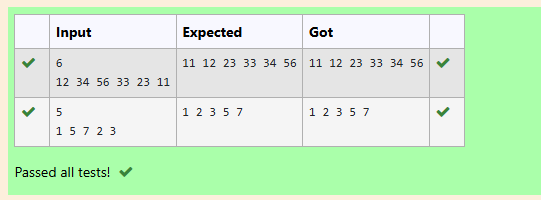

# Insert and Delete in B Tree
## 🏁 Aim
Write a C program to insert elements into a B-Tree and display the elements in sorted order using in-order traversal.

## 🔍 Algorithm
Define the B-Tree Node:

Each node contains an array of keys, an array of child pointers, and a count of keys.

### Insertion Procedure (insert function):

Call the setValue() function to find the correct position for the new key.

If setValue() returns a split condition, create a new root node using createNode().

Value Insertion in Nodes (setValue, insertNode, and splitNode functions):

Traverse down to the correct child recursively to find the insertion position.

If the node has space, insert the key in-place using insertNode().

If the node is full, split it using splitNode(), update the key, and pass the newly created child up the recursion.

### Deletion Procedure (delete function):

Attempt to remove the key using delValFromNode().

If the key is not found, print a message and return.

If the deletion results in an empty root node, reassign the root to its first child and free the empty node.

### In-Order Traversal:

Recursively traverse the left child, print the key, and then the right child for each key in the node to display keys in sorted order.

## 💻 Program
```
void insert(int val) {
  int flag, i;
  struct BTreeNode *child;

  flag = setValue(val, &i, root, &child);
  if (flag)
    root = createNode(i, child);
}

void delete (int item, struct BTreeNode *myNode) {
  // type your code here
  
  struct BTreeNode *tmp;
  if (!delValFromNode(item, myNode)) {
    printf("Given data is not present in B-Tree\n");
    return;
  } else {
    if (myNode->count == 0) {
      tmp = myNode;
      myNode = myNode->linker[0];
      free(tmp);
      root = myNode;
    }
  }
}
```
## 📤 Output

## ✅ Result
The program correctly inserts elements into a B-Tree and prints them in sorted order using in-order traversal.