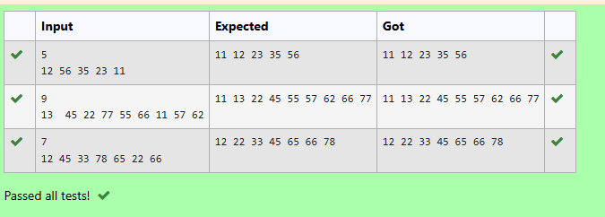

# B+ Tree insertion program in C
## 🏁 Aim
Write a C program to insert elements into a B+ Tree and display the elements in sorted order.

## 🔍 Algorithm
### Initialize the Tree:

Start with a NULL root.

If the tree is empty, create a root node and insert the element.

### Check Root Full:

If the root is full (number of keys = max size), split the root using split_child() and promote the middle key.

### Traverse to Leaf:

Use a loop to navigate to the correct child until a leaf node is reached.

At each internal node, check if the corresponding child is full.

If yes, split the child, adjust parent keys, and re-choose the path based on the promoted key.

### Insert into Leaf:

Once the correct leaf node is found, insert the value in sorted order.

### Helper Functions:

split_child(parent, index): Splits the full child at index and promotes the middle key to the parent.

sort(arr, n): Sorts the data in the node after insertion.

## 💻 Program Snippet
```
void insert(int a)
{
    //type your code here
    
    int i, temp;
    if (root == NULL)
    {
        root = init();
        root->data[0] = a;
        root->n = 1;
        return;
    }

    x = root;
    if (x->n == 5)
    {
        split_child(x, -1);
        x = root;
    }

    while (!x->leaf)
    {
        for (i = 0; i < x->n && a > x->data[i]; i++);
        if (x->child_ptr[i]->n == 5)
        {
            temp = split_child(x, i);
            x->data[x->n++] = temp;
            sort(x->data, x->n - 1);
            if (a > temp) i++;
        }
        x = x->child_ptr[i];
    }

    x->data[x->n++] = a;
    sort(x->data, x->n - 1);
}
```

## 📤 Output

## ✅ Result
The program successfully inserts elements into a B+ Tree and displays the keys in sorted order using leaf node traversal.